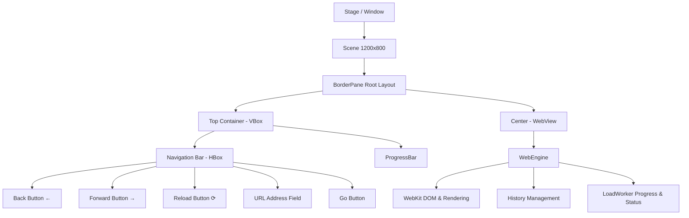

# Basic Web Browser - Completed Implementation Plan & Architecture

Comprehensive overview and documentation of the completed implementation for the JavaFX-based desktop Web Browser application.

---

## 1. Project Overview & Tech Stack

The application is a desktop web browser built with JavaFX and Maven.

- **Java Version**: Java 21 LTS ([pom.xml](file:///c:/Users/T-rex/Desktop/BasicWebBrowser/pom.xml))
- **GUI Toolkit**: JavaFX 21 (`javafx-controls`, `javafx-web`)
- **Rendering Engine**: WebKit (`javafx.scene.web.WebView`, `javafx.scene.web.WebEngine`)
- **Build System**: Maven with `javafx-maven-plugin` (0.0.8)
- **Styling**: Modern CSS3 styling with custom JavaFX theme ([styles.css](file:///c:/Users/T-rex/Desktop/BasicWebBrowser/src/main/resources/styles.css))

---

## 2. Completed Architecture & Components



---

## 3. Implemented Features Summary

### A. Navigation & History Controls
- **Back & Forward Navigation**:
  - Connected directly to `WebEngine.getHistory().go(-1)` and `WebEngine.getHistory().go(1)`.
  - Exception handling for boundary states (when history ends).
- **Reload / Refresh**:
  - Triggers `WebEngine.reload()` to refresh current web page.
- **URL / Search Input**:
  - Auto-normalizes URLs (automatically prepends `https://` if protocol omitted).
  - Handles Enter key submission as well as click-to-navigate via the "Go" button.
- **Dynamic Address Bar Synchronization**:
  - URL text field dynamically updates when internal web page links are navigated (ignores internal `data:` URIs).
- **Dynamic Window Title**:
  - Listens to `WebEngine.titleProperty()` to synchronize the Stage window title with the active web page title (defaults to `"Basic Web Browser"`).

### B. Visual Feedback & Progress Tracking
- **Slim Modern Progress Indicator**:
  - Real-time progress bar bound to `WebEngine.getLoadWorker().progressProperty()`.
  - Dynamic visibility tied to `WebEngine.getLoadWorker().runningProperty()` (auto-hides when page finishes loading).
  - Gradient styling (`#3b82f6` to `#8b5cf6`) with minimal 2.5px height profile.

### C. Default Modern Home Page (Start Screen)
- Responsive dark-theme dashboard loaded via `engine.loadContent()` with CSS animations.
- Quick navigation shortcuts:
  - 🔍 **Google** (`https://www.google.com`)
  - 💻 **GitHub** (`https://github.com`)
  - 📚 **Wikipedia** (`https://en.wikipedia.org`)
  - 🚀 **Hacker News** (`https://news.ycombinator.com`)
- Glassmorphism UI cards with hover elevations and glow effects.

### D. Modern CSS Design System ([styles.css](file:///c:/Users/T-rex/Desktop/BasicWebBrowser/src/main/resources/styles.css))
- Clean, Apple/Inter-inspired typography.
- Pill-shaped URL input bar with focus glow and subtle hover states.
- Rounded navigation action buttons with smooth active and hover feedback.
- Borderless gradient progress bar matching modern browsers (Chrome/Safari style).

---

## 4. File Manifest & Structure

```
BasicWebBrowser/
├── pom.xml                                    # Maven dependencies & JavaFX build config
└── src/
    └── main/
        ├── java/
        │   └── org/
        │       └── example/
        │           └── App.java               # Main JavaFX application and browser logic
        └── resources/
            └── styles.css                     # Custom CSS styles for JavaFX controls
```

| File | Status | Description |
| :--- | :--- | :--- |
| [pom.xml](file:///c:/Users/T-rex/Desktop/BasicWebBrowser/pom.xml) | **Completed** | Configured Java 21, JavaFX Controls & WebKit dependencies |
| [App.java](file:///c:/Users/T-rex/Desktop/BasicWebBrowser/src/main/java/org/example/App.java) | **Completed** | Core UI layout, WebEngine bindings, navigation event handlers, and start page |
| [styles.css](file:///c:/Users/T-rex/Desktop/BasicWebBrowser/src/main/resources/styles.css) | **Completed** | UI styling for navbar, buttons, address bar, and loading progress indicator |

---

## 5. Verification & Running Instructions

### How to Run:
```bash
mvn clean javafx:run
```

### Verified Behaviors:
- Application boots to the custom Welcome / Start dashboard.
- Clicking shortcuts or typing addresses (e.g. `github.com`, `google.com`) loads pages over HTTPS.
- Progress bar activates during network load and hides upon completion.
- Window title updates to document title.
- Back and forward history buttons navigate through visited pages.

---

## 6. Potential Future Milestones / Roadmap (Optional)

If you wish to expand the browser further:
1. **Multi-Tab Support**: `TabPane` integration allowing multiple web pages simultaneously.
2. **Bookmarks Bar**: Saved shortcuts toolbar below the address bar.
3. **Browsing History Drawer/Dialog**: View and clear past visited URLs.
4. **Downloads Manager**: Handle file download events and save dialogs.
5. **Zoom Controls**: Page zoom in/out with `WebView.setFontScale()` and `WebView.setZoom()`.
